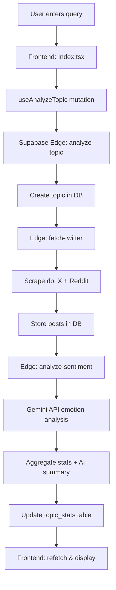

## System Overview

SENTi-radar is a serverless, event-driven sentiment analysis platform built on:

- **Frontend**: React 18 + TypeScript + Vite + shadcn-ui
- **Backend**: Supabase (Postgres + Edge Functions)
- **Data Sources**: X (Twitter), Reddit, YouTube, Google News
- **AI/ML**: Gemini API + keyword-based fallback
- **State Management**: TanStack React Query
- **Visualization**: Recharts + Framer Motion

<Note>
  The architecture follows a **tiered fallback strategy**: Scrape.do → Parallel.ai → YouTube → Algorithmic generation, ensuring the system always returns data even when APIs fail.
</Note>

## High-Level Data Flow



### Component Interaction Diagram

```
┌──────────────────────────────────────────────────────────────────────┐
│                         Frontend (React)                              │
├──────────────────────────────────────────────────────────────────────┤
│  TopicSearch  →  Index.tsx  →  useAnalyzeTopic  →  Supabase Client   │
│       ↓                                                      ↓         │
│  TopicDetail  ←  useRealtimeData  ←  React Query  ←  WebSocket       │
└──────────────────────────────────────────────────────────────────────┘
                                 ↓
┌──────────────────────────────────────────────────────────────────────┐
│                    Supabase Edge Functions (Deno)                     │
├──────────────────────────────────────────────────────────────────────┤
│  analyze-topic  →  fetch-twitter  →  fetch-youtube                    │
│       ↓                    ↓                ↓                          │
│  Scrape.do API      Scrape.do API    YouTube Data API v3             │
│       ↓                    ↓                ↓                          │
│  analyze-sentiment  ←  posts table  ←  Insert posts                   │
│       ↓                                                                │
│  Gemini API (emotion scoring) → topic_stats → sentiment_timeline      │
└──────────────────────────────────────────────────────────────────────┘
                                 ↓
┌──────────────────────────────────────────────────────────────────────┐
│                       Database (Postgres)                             │
├──────────────────────────────────────────────────────────────────────┤
│  topics  |  posts  |  topic_stats  |  sentiment_timeline  |  alerts   │
└──────────────────────────────────────────────────────────────────────┘
```

## Core Components

### 1. Frontend Architecture

#### Main Dashboard (`src/pages/Index.tsx`)

The central orchestrator that manages search, topic selection, and real-time updates:

```tsx src/pages/Index.tsx
import { useTopics, useAnalyzeTopic } from "@/hooks/useRealtimeData";
import TopicSearch from "@/components/TopicSearch";
import TopicDetail from "@/components/TopicDetail";

const Index = () => {
  const [selectedTopic, setSelectedTopic] = useState<TopicCard | null>(null);
  const { data: dbTopics, refetch: refetchTopics } = useTopics();
  const analyzeMutation = useAnalyzeTopic();

  const handleSearch = async (query: string) => {
    analyzeMutation.mutate(
      { query },
      {
        onSuccess: async (data) => {
          // Refetch topics list to include the new analysis
          const result = await refetchTopics();
          const found = result.data?.find(t => t.id === data.topic_id);
          if (found) setSelectedTopic(found);
        },
      }
    );
  };

  return (
    <SidebarProvider>
      <TopicSidebar topics={dbTopics} selectedId={selectedTopic?.id} />
      <main>
        <TopicSearch onSearch={handleSearch} isAnalyzing={analyzeMutation.isPending} />
        {selectedTopic && <TopicDetail topic={selectedTopic} />}
      </main>
    </SidebarProvider>
  );
};
```

**Key Responsibilities**:
- Trigger analysis via `useAnalyzeTopic` mutation
- Manage selected topic state
- Coordinate sidebar and detail view
- Handle real-time refetching after analysis

#### Real-Time Data Hook (`src/hooks/useRealtimeData.ts`)

Manages all backend communication and real-time subscriptions:

```typescript src/hooks/useRealtimeData.ts
import { useQuery, useMutation, useQueryClient } from "@tanstack/react-query";
import { supabase } from "@/integrations/supabase/client";

// Fetch topics with stats from DB
export function useTopics() {
  return useQuery({
    queryKey: ["topics"],
    queryFn: async () => {
      const { data: topics } = await supabase
        .from("topics")
        .select("*")
        .eq("is_active", true)
        .order("created_at", { ascending: false });

      const { data: stats } = await supabase
        .from("topic_stats")
        .select("*")
        .in("topic_id", topics.map(t => t.id));

      const statsMap = new Map(stats.map(s => [s.topic_id, s]));
      return topics.map(t => toTopicCard(t, statsMap.get(t.id)));
    },
  });
}

// Real-time live feed with WebSocket subscription
export function useLiveFeed() {
  const queryClient = useQueryClient();

  useEffect(() => {
    const channel = supabase
      .channel("live-posts")
      .on(
        "postgres_changes",
        { event: "INSERT", schema: "public", table: "posts" },
        () => queryClient.invalidateQueries({ queryKey: ["live-feed"] })
      )
      .subscribe();

    return () => supabase.removeChannel(channel);
  }, [queryClient]);

  return useQuery({ queryKey: ["live-feed"], queryFn: fetchLivePosts });
}
```

**Features**:
- React Query for caching and invalidation
- Real-time WebSocket subscriptions for live updates
- Automatic refetching on database changes
- Graceful degradation to mock data when backend fails

#### Topic Detail Component (`src/components/TopicDetail.tsx`)

Orchestrates data fetching and emotion analysis for a single topic:

```tsx src/components/TopicDetail.tsx
import { fetchAllScrapeDoSources, type ScrapeDoResult } from '@/services/scrapeDoProvider';

const TopicDetail = ({ topic, onClose }: Props) => {
  const [liveEmotions, setLiveEmotions] = useState<EmotionData[] | null>(null);
  const [scrapeDoResults, setScrapeDoResults] = useState<ScrapeDoResult[]>([]);

  const runAnalysis = async (t: TopicCard) => {
    // Step 1: Fetch from all sources in parallel
    const [ytResult, rssResult, scrapeResult] = await Promise.allSettled([
      fetchYouTubeComments(t.title),
      fetchNewsHeadlines(t.title),
      fetchAllScrapeDoSources(t.title, SCRAPE_TOKEN, ['x', 'reddit']),
    ]);

    const { results, posts } = scrapeResult.status === 'fulfilled' 
      ? scrapeResult.value 
      : { results: [], posts: [] };

    // Step 2: Analyze emotions from all text
    const analysis = analyzeTopicFully(t.title, rssHeadlines, comments, posts);
    setLiveEmotions(analysis.emotions);
    setScrapeDoResults(results);

    // Step 3: Generate AI summary (Gemini → Groq → local fallback)
    await streamSummary({ topic: t, onDelta, onDone, onEmotionsReady });
  };

  return (
    <div>
      {/* Display Scrape.do source status chips */}
      {scrapeDoResults.map(r => (
        <span className={r.status === 'success' ? 'bg-green-500/10' : 'bg-red-500/10'}>
          {r.source}: {r.posts.length} posts
        </span>
      ))}

      <EmotionBreakdown emotions={liveEmotions || topic.emotions} />
      <SentimentChart data={sentimentTimeline} />
      <ReactMarkdown>{aiSummary}</ReactMarkdown>
    </div>
  );
};
```

**Key Features**:
- Parallel data fetching from X, Reddit, YouTube, Google News
- Real-time emotion scoring from scraped content
- AI summary streaming with 3-tier fallback (Gemini → Groq → local)
- Source status indicators for transparency

### 2. Backend Architecture

#### Scrape.do Provider (`src/services/scrapeDoProvider.ts`)

Universal scraping provider for X and Reddit:

```typescript src/services/scrapeDoProvider.ts
export interface ScrapeDoOptions {
  render?: boolean;        // JavaScript rendering (essential for X)
  super?: boolean;         // Use residential proxies
  waitUntil?: "networkidle0" | "networkidle2" | "load";
  geoCode?: string;        // ISO country code for geo-targeting
}

export function buildApiUrl(
  token: string,
  targetUrl: string,
  options: ScrapeDoOptions = {}
): string {
  const params = new URLSearchParams();
  params.set("token", token);
  params.set("url", targetUrl);
  if (options.render !== false) params.set("render", "true");
  if (options.super) params.set("super", "true");
  if (options.waitUntil) params.set("waitUntil", options.waitUntil);
  if (options.geoCode) params.set("geoCode", options.geoCode);
  return `https://api.scrape.do?${params.toString()}`;
}

export async function fetchXPosts(
  query: string,
  token: string,
  options: ScrapeDoOptions = {}
): Promise<ScrapeDoResult> {
  const targetUrl = `https://x.com/search?q=${encodeURIComponent(query)}&f=live`;
  const apiUrl = buildApiUrl(token, targetUrl, {
    render: true,
    waitUntil: "networkidle0",
    ...options,
  });

  const res = await fetch(apiUrl);
  const html = await res.text();
  const posts = parseXHtml(html, query);

  return {
    posts,
    source: "X via Scrape.do",
    status: posts.length > 0 ? "success" : "partial",
  };
}
```

**Architecture Benefits**:
- **Abstraction**: Single API for multiple platforms
- **Extensibility**: Add new sources by implementing `fetchXXXPosts()`
- **Resilience**: Returns structured `ScrapeDoResult` with status and error info
- **Performance**: Parallel fetching via `fetchAllScrapeDoSources()`

#### Edge Function: fetch-twitter (`supabase/functions/fetch-twitter/index.ts`)

Serverless function that fetches posts from X and Reddit:

```typescript supabase/functions/fetch-twitter/index.ts
serve(async (req) => {
  const SCRAPE_DO_TOKEN = Deno.env.get("SCRAPE_DO_TOKEN");
  const { topic_id } = await req.json();

  const { data: topic } = await supabase
    .from("topics")
    .select("*")
    .eq("id", topic_id)
    .single();

  let posts: ScrapedPost[] = [];

  // Step 1: Scrape.do – X and Reddit in parallel
  if (SCRAPE_DO_TOKEN) {
    const [xResult, redditResult] = await Promise.allSettled([
      fetch(buildScrapeDoUrl(SCRAPE_DO_TOKEN, xUrl, { render: true })),
      fetch(buildScrapeDoUrl(SCRAPE_DO_TOKEN, redditUrl, { render: false })),
    ]);

    if (xResult.status === "fulfilled" && xResult.value.ok) {
      const html = await xResult.value.text();
      posts.push(...parseXHtml(html, topic.query));
    }

    if (redditResult.status === "fulfilled" && redditResult.value.ok) {
      const data = await redditResult.value.json();
      posts.push(...parseRedditJson(data, topic.query));
    }
  }

  // Step 2: YouTube fallback
  if (posts.length === 0 && YOUTUBE_API_KEY) {
    const ytRes = await fetch(youtubeSearchUrl);
    const ytData = await ytRes.json();
    posts = ytData.items.map(item => ({
      text: `${item.snippet.title}: ${item.snippet.description}`,
      platform: "youtube",
    }));
  }

  // Step 3: Persist to DB
  for (const post of posts) {
    await supabase.from("posts").upsert({
      topic_id,
      platform: post.platform,
      content: post.text,
      author: post.author,
    });
  }

  return new Response(JSON.stringify({ fetched: posts.length }));
});
```

**Tiered Fallback Strategy**:
1. **Scrape.do** (X + Reddit) — primary source
2. **Parallel.ai** — web search fallback
3. **YouTube** — video content fallback
4. **Algorithmic** — template-based generation

#### Edge Function: analyze-sentiment (`supabase/functions/analyze-sentiment/index.ts`)

Runs emotion analysis on fetched posts:

```typescript supabase/functions/analyze-sentiment/index.ts
serve(async (req) => {
  const GEMINI_API_KEY = Deno.env.get("GEMINI_API_KEY");
  const { topic_id } = await req.json();

  // Fetch unanalyzed posts
  const { data: posts } = await supabase
    .from("posts")
    .select("*")
    .eq("topic_id", topic_id)
    .is("sentiment", null)
    .limit(50);

  // Step 1: Analyze sentiment with Gemini (fallback to keywords)
  const prompt = `Analyze each post and return JSON:
  {"results": [{"index": 0, "sentiment": "positive", "primary_emotion": "joy", "emotion_scores": {...}}]}`;

  let analysisResults;
  try {
    const geminiData = await callGemini(GEMINI_API_KEY, prompt);
    analysisResults = geminiData.results;
  } catch {
    // Keyword-based fallback
    analysisResults = posts.map((p, i) => ({
      index: i,
      ...analyzePostFallback(p.content),
    }));
  }

  // Step 2: Update posts in DB
  for (const result of analysisResults) {
    await supabase.from("posts").update({
      sentiment: result.sentiment,
      primary_emotion: result.primary_emotion,
      emotion_scores: result.emotion_scores,
    }).eq("id", posts[result.index].id);
  }

  // Step 3: Compute aggregates
  const emotionCounts = { joy: 0, anger: 0, sadness: 0, fear: 0, surprise: 0, disgust: 0 };
  posts.forEach(p => emotionCounts[p.primary_emotion]++);

  // Step 4: Generate AI summary
  const summaryData = await callGemini(GEMINI_API_KEY, summaryPrompt);

  // Step 5: Upsert topic_stats
  await supabase.from("topic_stats").upsert({
    topic_id,
    overall_sentiment: overallSentiment,
    emotion_breakdown: emotionBreakdown,
    ai_summary: summaryData.summary,
    volatility: summaryData.volatility,
  });

  return new Response(JSON.stringify({ analyzed: analysisResults.length }));
});
```

**Analysis Pipeline**:
1. Fetch unanalyzed posts from database
2. Batch analyze with Gemini API (or keyword fallback)
3. Update posts with sentiment + emotion scores
4. Compute aggregated stats (emotion breakdown, crisis level)
5. Generate AI summary with context-aware prompts
6. Store results in `topic_stats` table

### 3. Database Schema

#### Core Tables

```sql
-- Topics being monitored
CREATE TABLE topics (
  id UUID PRIMARY KEY DEFAULT uuid_generate_v4(),
  title TEXT NOT NULL,
  hashtag TEXT NOT NULL,
  query TEXT NOT NULL,
  platform TEXT,
  is_trending BOOLEAN DEFAULT false,
  is_active BOOLEAN DEFAULT true,
  created_at TIMESTAMP DEFAULT NOW()
);

-- Scraped posts from social media
CREATE TABLE posts (
  id UUID PRIMARY KEY DEFAULT uuid_generate_v4(),
  topic_id UUID REFERENCES topics(id) ON DELETE CASCADE,
  platform TEXT NOT NULL,  -- 'x', 'reddit', 'youtube'
  external_id TEXT,
  author TEXT,
  content TEXT NOT NULL,
  sentiment TEXT,          -- 'positive', 'negative', 'mixed', 'neutral'
  primary_emotion TEXT,    -- 'joy', 'anger', 'sadness', 'fear', 'surprise', 'disgust'
  emotion_scores JSONB,
  posted_at TIMESTAMP,
  fetched_at TIMESTAMP DEFAULT NOW(),
  UNIQUE(platform, external_id)
);

-- Aggregated sentiment stats per topic
CREATE TABLE topic_stats (
  id UUID PRIMARY KEY DEFAULT uuid_generate_v4(),
  topic_id UUID REFERENCES topics(id) ON DELETE CASCADE,
  total_volume INTEGER,
  volume_change INTEGER,
  overall_sentiment TEXT,
  crisis_level TEXT,       -- 'none', 'low', 'medium', 'high'
  volatility INTEGER,
  emotion_breakdown JSONB,
  top_phrases JSONB,
  ai_summary TEXT,
  key_takeaways JSONB,
  computed_at TIMESTAMP DEFAULT NOW(),
  UNIQUE(topic_id)
);

-- Time-series sentiment data for charts
CREATE TABLE sentiment_timeline (
  id UUID PRIMARY KEY DEFAULT uuid_generate_v4(),
  topic_id UUID REFERENCES topics(id) ON DELETE CASCADE,
  positive_pct INTEGER,
  negative_pct INTEGER,
  neutral_pct INTEGER,
  volume INTEGER,
  recorded_at TIMESTAMP DEFAULT NOW()
);

-- Crisis alerts and notifications
CREATE TABLE alerts (
  id UUID PRIMARY KEY DEFAULT uuid_generate_v4(),
  topic_id UUID REFERENCES topics(id) ON DELETE CASCADE,
  alert_type TEXT,         -- 'crisis_spike', 'sentiment_shift'
  message TEXT,
  severity TEXT,           -- 'low', 'medium', 'high'
  is_read BOOLEAN DEFAULT false,
  created_at TIMESTAMP DEFAULT NOW()
);
```

## Data Flow Example

Here's a complete trace of analyzing "climate change":

<Steps>
  <Step title="User triggers analysis">
    User enters "climate change" in search bar and clicks **Analyze**.

    ```tsx
    handleSearch("climate change")
      → analyzeMutation.mutate({ query: "climate change" })
      → supabase.functions.invoke("analyze-topic", { body: { query } })
    ```
  </Step>

  <Step title="analyze-topic creates topic">
    Edge function creates a new topic record:

    ```typescript
    const { data: topic } = await supabase.from("topics").insert({
      title: "Climate Change",
      hashtag: "#ClimateChange",
      query: "climate change",
      platform: "both",
    }).select().single();
    ```
  </Step>

  <Step title="fetch-twitter scrapes data">
    Invokes `fetch-twitter` to scrape X and Reddit:

    ```typescript
    const { results, posts } = await fetchAllScrapeDoSources(
      "climate change",
      SCRAPE_DO_TOKEN,
      ["x", "reddit"]
    );

    // Scrape.do fetches:
    // - X: https://x.com/search?q=climate%20change&f=live
    // - Reddit: https://reddit.com/search.json?q=climate%20change

    // Inserts 25 posts into posts table
    ```
  </Step>

  <Step title="analyze-sentiment runs emotion analysis">
    Analyzes posts with Gemini:

    ```typescript
    const geminiData = await callGemini(GEMINI_API_KEY, analysisPrompt);
    // Returns: [{ sentiment: "negative", primary_emotion: "fear", emotion_scores: {...} }]

    // Updates posts table with sentiment + emotions
    // Computes aggregates:
    //   - 45% fear, 30% anger, 15% sadness
    //   - Overall sentiment: negative
    //   - Crisis level: medium
    ```
  </Step>

  <Step title="AI summary generation">
    Generates narrative summary:

    ```typescript
    const summaryData = await callGemini(GEMINI_API_KEY, summaryPrompt);
    // Returns:
    // {
    //   "summary": "Public reaction to Climate Change is dominated by fear (45%) and anger (30%)...",
    //   "key_takeaways": [...],
    //   "volatility": 72
    // }

    // Upserts topic_stats with summary + aggregates
    ```
  </Step>

  <Step title="Frontend displays results">
    React Query refetches and updates UI:

    ```tsx
    const result = await refetchTopics();
    const found = result.data?.find(t => t.id === topicId);
    setSelectedTopic(found);

    // TopicDetail renders:
    // - Emotion breakdown (fear 45%, anger 30%)
    // - AI summary with real post excerpts
    // - Sentiment timeline chart
    // - Crisis alert badge
    ```
  </Step>
</Steps>

## Extensibility

### Adding a New Data Source

To add LinkedIn or Hacker News:

1. **Create fetcher in `scrapeDoProvider.ts`**:

```typescript src/services/scrapeDoProvider.ts
export async function fetchLinkedInPosts(
  query: string,
  token: string,
  options: ScrapeDoOptions = {}
): Promise<ScrapeDoResult> {
  const targetUrl = `https://www.linkedin.com/search/results/content/?keywords=${encodeURIComponent(query)}`;
  const apiUrl = buildApiUrl(token, targetUrl, { render: true, ...options });

  const res = await fetch(apiUrl);
  const html = await res.text();
  const posts = parseLinkedInHtml(html, query);

  return { posts, source: "LinkedIn via Scrape.do", status: posts.length > 0 ? "success" : "partial" };
}
```

2. **Add to `fetchAllScrapeDoSources`**:

```typescript
export async function fetchAllScrapeDoSources(
  query: string,
  token: string,
  sources: Array<"x" | "reddit" | "linkedin"> = ["x", "reddit", "linkedin"]
) {
  const fetchers = sources.map(src => {
    if (src === "x") return fetchXPosts(query, token);
    if (src === "reddit") return fetchRedditPosts(query, token);
    if (src === "linkedin") return fetchLinkedInPosts(query, token);
  });

  const settled = await Promise.allSettled(fetchers);
  // ... merge results
}
```

3. **Update edge function**:

```typescript supabase/functions/fetch-twitter/index.ts
const { results, posts } = await fetchAllScrapeDoSources(
  topic.query,
  SCRAPE_DO_TOKEN,
  ["x", "reddit", "linkedin"]
);
```

### Custom Emotion Models

Replace keyword-based scoring with a fine-tuned model:

```typescript
import { pipeline } from '@huggingface/transformers';

const classifier = await pipeline('text-classification', 'j-hartmann/emotion-english-distilroberta-base');

export async function scoreEmotionsML(texts: string[]): Promise<EmotionData[]> {
  const results = await classifier(texts);
  const emotionCounts = { joy: 0, anger: 0, sadness: 0, fear: 0, surprise: 0, disgust: 0 };

  results.forEach(r => {
    const label = r.label.toLowerCase();
    if (emotionCounts[label] !== undefined) emotionCounts[label]++;
  });

  const total = texts.length;
  return Object.entries(emotionCounts).map(([emotion, count]) => ({
    emotion,
    percentage: Math.round((count / total) * 100),
    count,
  }));
}
```

## Performance Optimizations

### Caching Strategy

- **React Query cache**: 5-minute stale time for topics, 30-second for live feed
- **Edge function caching**: Cache Scrape.do results for 60 seconds per query
- **Database indexes**: Composite indexes on `(topic_id, fetched_at)` for fast queries

### Parallel Processing

```typescript
// Fetch all sources in parallel
const [ytResult, rssResult, scrapeResult] = await Promise.allSettled([
  fetchYouTubeComments(query),
  fetchNewsHeadlines(query),
  fetchAllScrapeDoSources(query, token, ['x', 'reddit']),
]);

// Process results independently
const allPosts = [
  ...scrapeResult.value.posts,
  ...ytResult.value.comments.map(c => ({ text: c })),
];
```

### Database Query Optimization

```sql
-- Index for fast topic stats lookup
CREATE INDEX idx_topic_stats_topic_id ON topic_stats(topic_id);

-- Composite index for sentiment timeline queries
CREATE INDEX idx_sentiment_timeline_topic_time 
  ON sentiment_timeline(topic_id, recorded_at DESC);

-- Partial index for unanalyzed posts
CREATE INDEX idx_posts_unanalyzed 
  ON posts(topic_id) WHERE sentiment IS NULL;
```

## Security Considerations

<Warning>
  **Never expose API keys in client-side code.** All `VITE_` prefixed variables are embedded in the JavaScript bundle and visible to users.
</Warning>

### Production Security Checklist

- [ ] Move `VITE_SCRAPE_TOKEN` to Supabase secrets
- [ ] Call Scrape.do only from edge functions (not frontend)
- [ ] Enable Row-Level Security (RLS) on all tables
- [ ] Implement rate limiting on edge functions
- [ ] Add CORS restrictions to Supabase API
- [ ] Use service role key only in edge functions
- [ ] Sanitize user input in search queries
- [ ] Validate Scrape.do responses before parsing

### Example RLS Policy

```sql
-- Users can only see their own saved topics
CREATE POLICY "Users can view own saved topics"
  ON saved_topics FOR SELECT
  USING (auth.uid() = user_id);

-- Topics are public but insertion requires authentication
CREATE POLICY "Anyone can view topics"
  ON topics FOR SELECT
  USING (true);

CREATE POLICY "Authenticated users can create topics"
  ON topics FOR INSERT
  WITH CHECK (auth.uid() IS NOT NULL);
```

## Next Steps

<CardGroup cols={2}>
  <Card title="Quickstart Guide" icon="rocket" href="/quickstart">
    Get SENTi-radar running locally in 5 minutes
  </Card>

  <Card title="Edge Functions API" icon="book" href="/edge-functions/overview">
    Explore edge function endpoints and request/response schemas
  </Card>

  <Card title="Development Guide" icon="code" href="/development/getting-started">
    Contributing guidelines, testing, and local Supabase setup
  </Card>

  <Card title="Deployment" icon="cloud" href="/deployment/overview">
    Deploy to production with Vercel and Supabase
  </Card>
</CardGroup>
