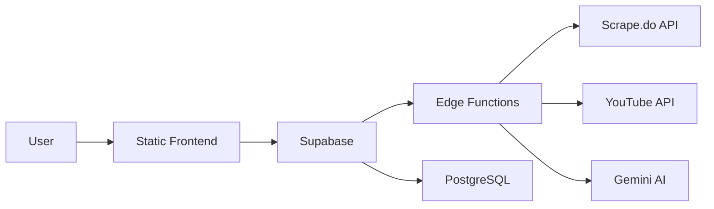

SENTi-radar is a real-time sentiment analysis dashboard built with Vite, React, and Supabase. This guide covers deploying both the frontend and backend edge functions to production.

## Architecture

SENTi-radar consists of two main deployment targets:

1. **Frontend (Static)**: Vite-built React SPA hosted on static hosting platforms
2. **Backend (Edge Functions)**: Deno-based Supabase edge functions for data scraping and analysis



## Prerequisites

Before deploying, ensure you have:

<Steps>
  <Step title="Node.js & npm installed">
    Version 18.x or later recommended
  </Step>
  
  <Step title="Supabase project created">
    Sign up at [supabase.com](https://supabase.com) and create a new project
  </Step>
  
  <Step title="Supabase CLI installed">
    ```bash
    npm install -g supabase
    ```
  </Step>
  
  <Step title="API keys obtained">
    - Scrape.do API token (for X/Twitter & Reddit)
    - YouTube Data API v3 key (optional)
    - Gemini API key (optional)
  </Step>
</Steps>

## Deployment Platforms

### Frontend

The frontend can be deployed to any static hosting platform:

- **Lovable** (recommended) - Zero-config deployment
- **Vercel** - Automatic builds from Git
- **Netlify** - Continuous deployment
- **Cloudflare Pages** - Global edge network
- **AWS S3 + CloudFront** - Enterprise-grade hosting

### Backend

Edge functions run on **Supabase Edge Runtime** (powered by Deno Deploy):

- Global edge network
- Zero cold starts
- Automatic scaling
- Built-in CORS handling

## Quick Deploy

<Steps>
  <Step title="Clone and install dependencies">
    ```bash
    git clone <repository-url>
    cd <repository-name>
    npm install
    ```
  </Step>
  
  <Step title="Configure environment variables">
    See [Environment & Secrets](/deployment/environment-secrets) for complete setup
  </Step>
  
  <Step title="Deploy edge functions">
    See [Edge Functions Deployment](/deployment/edge-functions)
  </Step>
  
  <Step title="Deploy frontend">
    See [Frontend Deployment](/deployment/frontend)
  </Step>
</Steps>

## Environment Overview

<CardGroup cols={2}>
  <Card title="Frontend Environment" icon="browser">
    **Vite env vars (VITE_*)**
    - Supabase URL & keys
    - Scrape.do token
    - YouTube API key
    - Gemini/Groq API keys
  </Card>
  
  <Card title="Edge Function Secrets" icon="lock">
    **Supabase secrets**
    - SCRAPE_DO_TOKEN
    - YOUTUBE_API_KEY
    - GEMINI_API_KEY
    - SUPABASE_SERVICE_ROLE_KEY
  </Card>
</CardGroup>

<Warning>
  Never commit `.env` files to version control. Use `.env.example` as a template and set production secrets via platform-specific secret management.
</Warning>

## Production Checklist

Before going live, verify:

- [ ] All environment variables are set correctly
- [ ] Edge functions are deployed and accessible
- [ ] Database migrations are applied
- [ ] CORS headers are configured in `supabase/config.toml`
- [ ] API rate limits are configured
- [ ] Error monitoring is enabled (Sentry, LogRocket, etc.)
- [ ] SSL/TLS certificates are active
- [ ] CDN caching is configured for static assets

## Next Steps

<CardGroup cols={3}>
  <Card title="Frontend Deployment" icon="react" href="/deployment/frontend">
    Deploy the Vite React application
  </Card>
  
  <Card title="Edge Functions" icon="code" href="/deployment/edge-functions">
    Deploy Supabase edge functions
  </Card>
  
  <Card title="Environment Setup" icon="key" href="/deployment/environment-secrets">
    Configure secrets and API keys
  </Card>
</CardGroup>